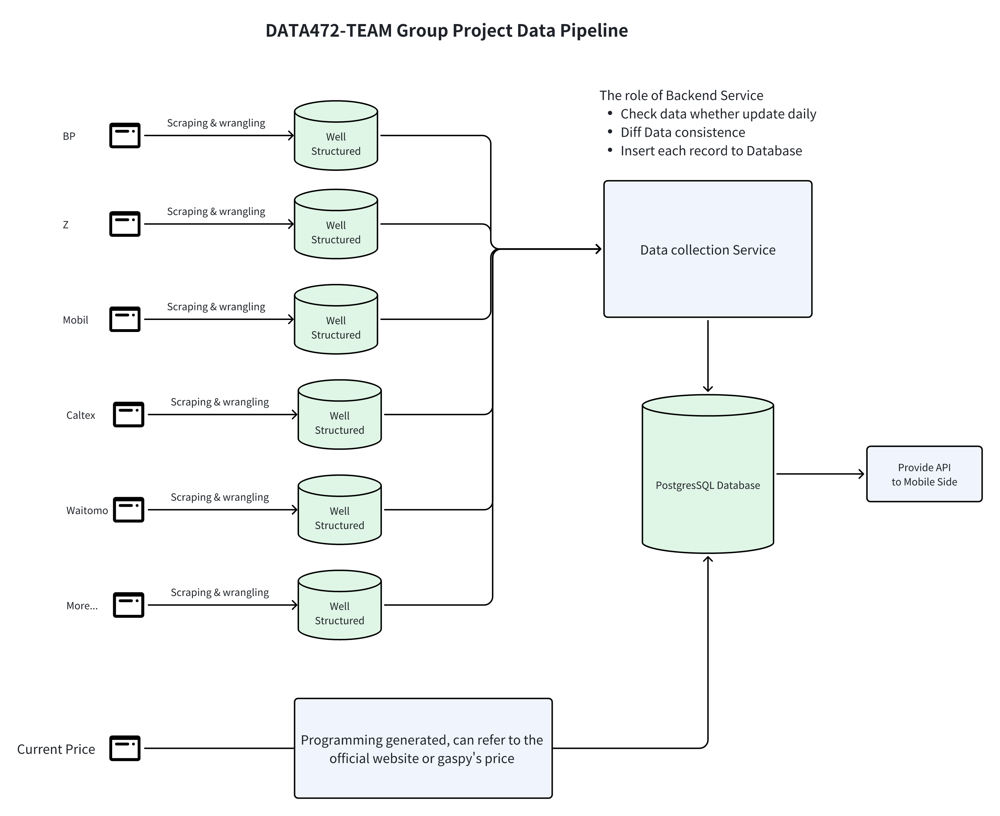
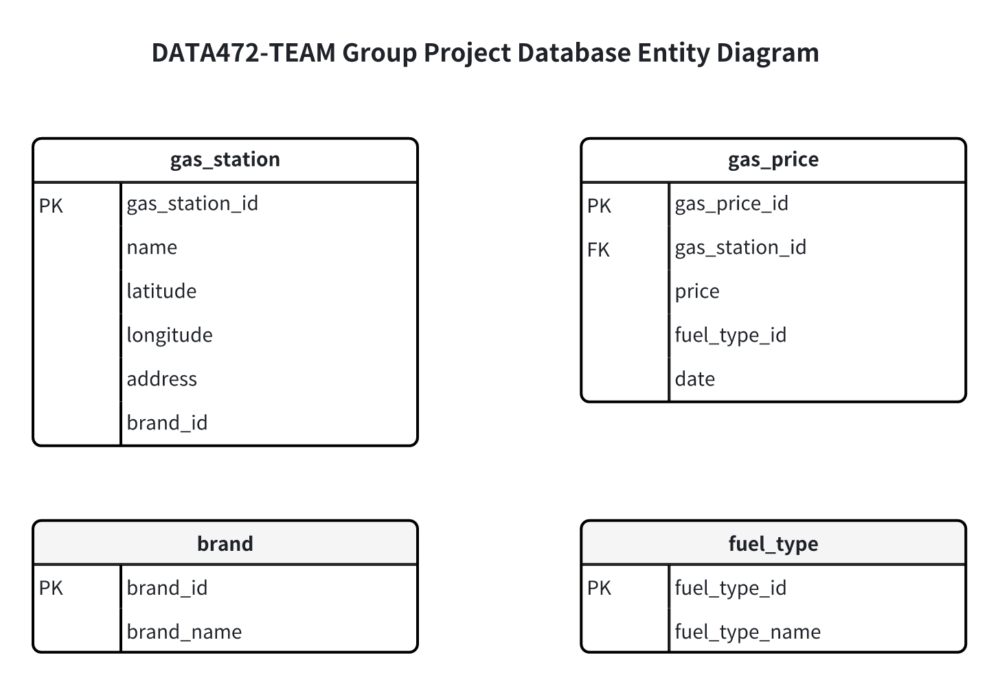
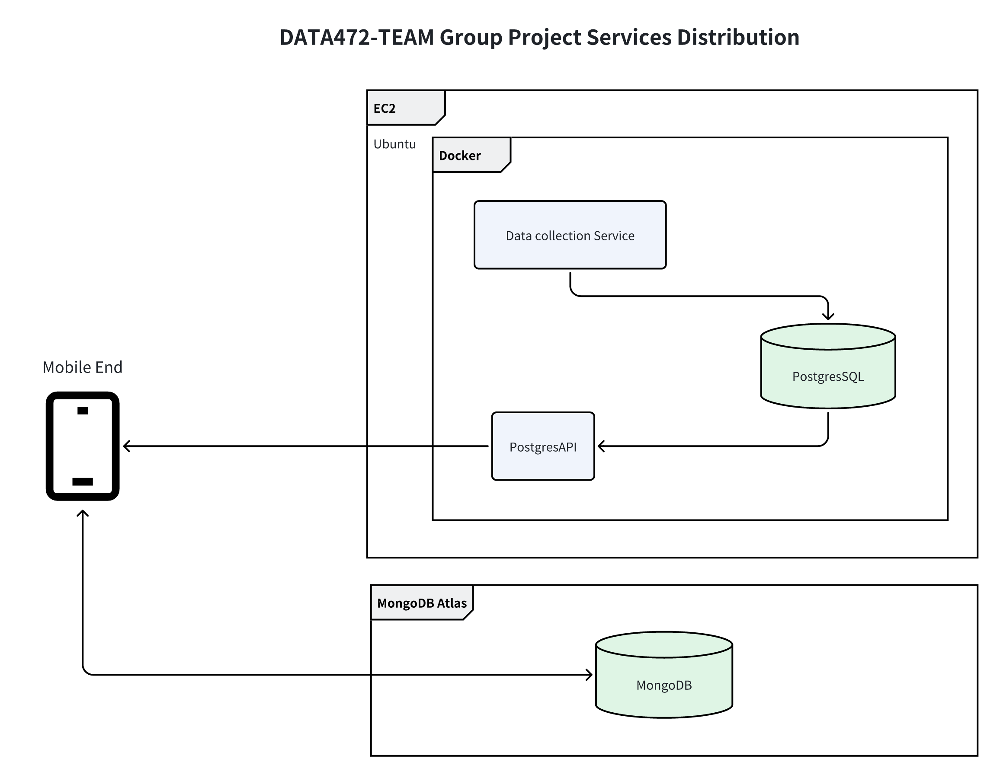

# TEAM Project Design

## Project Overview

## Project Design

Main workflow

- Data collection

> Data collection from each Gas brand official website to get the gas station information.

- Data processing

> Clean the data and store it in the database. Daily update the data. Check the existence of the gas station and whether the website updated the data.

- Data storage

> Store the data in the PostgreSQL database.

- API providing

> Provide the API for the mobileend with PostgresAPI.

### Data pipeline

### Data Model

### Services

