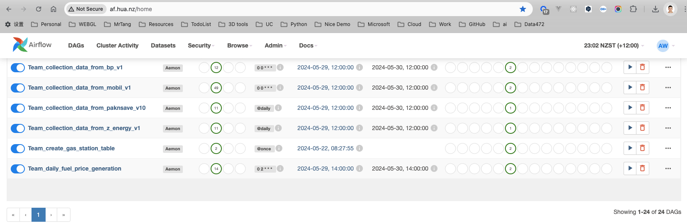
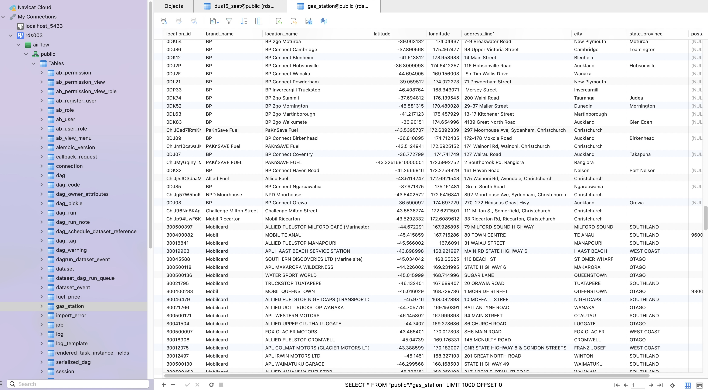
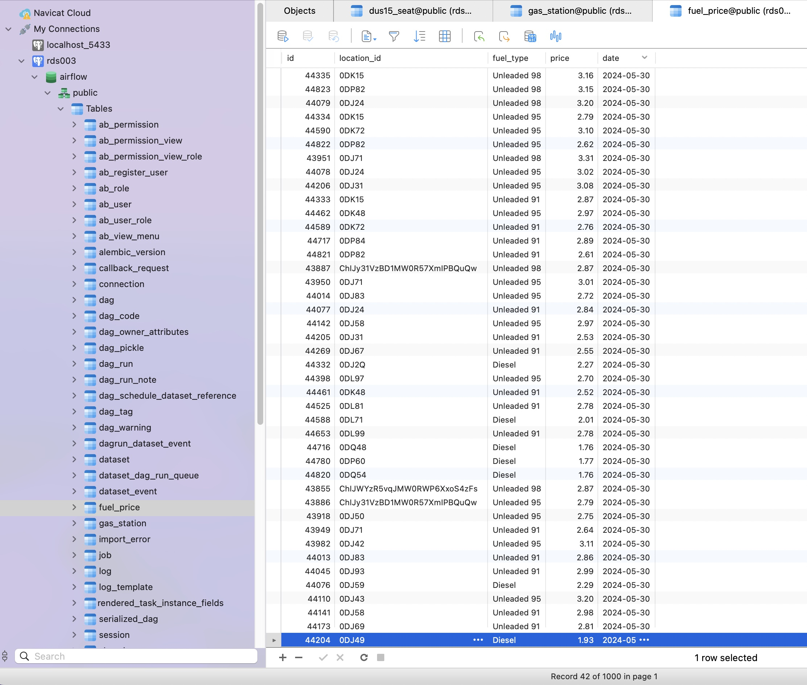
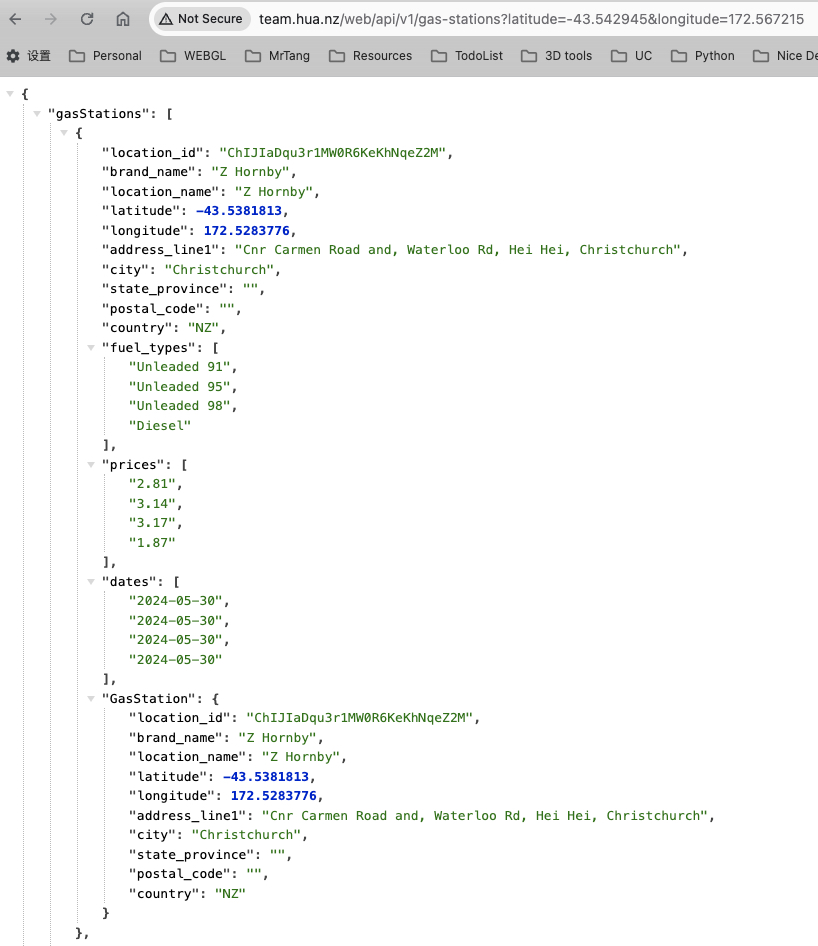

# Data472 Group Project

## TEAM & Members

- [Hua Wang](mailto:hwa205@uclive.ac.nz)
- [Hussain Ravat](mailto:hra80@uclive.ac.nz)
- [Panli Wang](mailto:pwa115@uclive.ac.nz)
- [Swathy Padinjareveliyil Thankachan](mailto:spa256@uclive.ac.nz)

## Project Overview

The project used micro-service architecture, consists of 4 repositories within the GitHub organization "TEAM-Data-Engineers." Each repository serves a specific purpose in the overall project, which is related to fuel recommendation in Christchurch. The entire application includes Data collection pipeline, Web API provider, and Mobile end interface. Here’s a brief overview of each repository based on their information:

## Project Architecture

1. **Data Collection Service**:
   - **Language**: Python integrated with Apache Airflow
   - **Purpose**: Data collection pipeline for the CHCH Fuel Recommendation project.
   - **Address**: [CHCHFR-Data-Collection](https://github.com/TEAM-Data-Engineers/CHCHFR-Data-Collection)

2. **Web API Provider Service**:
   - **Language**: Node.js on Express
   - **Purpose**: Web API for the CHCH Fuel Recommendation Mobile App.
   - **Address**: [CHCHFR-Web-API](https://github.com/TEAM-Data-Engineers/CHCHFR-Web-API)

3. **Mobile End Service**:
   - **Language**: Node.js on React Native
   - **Purpose**: Mobile application as a Frontend for the CHCH Fuel Recommendation project.
   - **Address**: [CHCHFR-Mobile](https://github.com/TEAM-Data-Engineers/CHCHFR-Mobile)

4. **Documentation**:
   - **Language**: Markdown
   - **Purpose**: Documentation for the CHCH Fuel Recommendation project.
   - **Address**: [CHCHFR-Docs](https://github.com/TEAM-Data-Engineers/CHCHFR-Docs)

## Key features of screenshots

> **Note**: The Data collection task shows on Airflow Dashboard

---

> **Note**: The Gas Station are stored in the PostgreSQL database.

---

> **Note**: The Fuel Price are stored in the PostgreSQL database.

---

 
> **Note**: The screenshots are taken from the mobile application, which is the frontend of the project.

---

> **Note**: The Web API response is shown in the browser.

---
