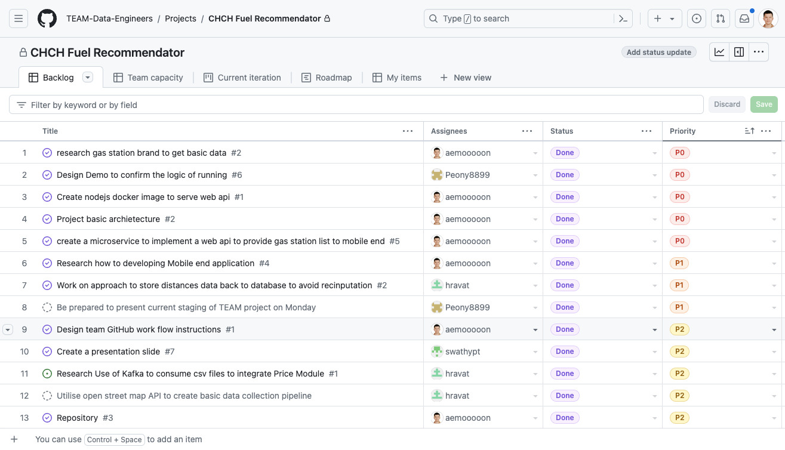

# Data472 - Data Engineering 24S1 Group Project

## TEAM & Members

- [Hua Wang](mailto:hwa205@uclive.ac.nz)
- [Hussain Ravat](mailto:hra80@uclive.ac.nz)
- [Panli Wang](mailto:pwa115@uclive.ac.nz)
- [Swathy Padinjareveliyil Thankachan](mailto:spa256@uclive.ac.nz)

## Project Overview

The project used micro-service architecture and consisted of 4 repositories within the GitHub organization "TEAM-Data-Engineers." Each repository serves a specific purpose in the overall project, which is related to fuel recommendations in Christchurch. The entire application includes a Data collection ETL pipeline, Web API provider, and Mobile end interface. Here’s a brief overview of each repository based on their information:

## Project Architecture

1. **Data Collection Service**:
   - **Language**: Python-based DAG task integrated within Apache Airflow
   - **Purpose**: Data ETL pipeline for the CHCH Fuel Recommendation project.
   - **Address**: [CHCHFR-Data-Collection](https://github.com/TEAM-Data-Engineers/CHCHFR-Data-Collection)

2. **Web API Provider Service**:
   - **Language**: Node.js on Express
   - **Purpose**: Web API for the CHCH Fuel Recommendation Mobile App.
   - **Address**: [CHCHFR-Web-API](https://github.com/TEAM-Data-Engineers/CHCHFR-Web-API)

3. **Mobile End Service**:
   - **Language**: Node.js on React Native
   - **Purpose**: Mobile application as a Frontend for the CHCH Fuel Recommendation project.
   - **Address**: [CHCHFR-Mobile](https://github.com/TEAM-Data-Engineers/CHCHFR-Mobile)

4. **Documentation**:
   - **Language**: Markdown
   - **Purpose**: Documentation for the CHCH Fuel Recommendation project.
   - **Address**: [CHCHFR-Docs](https://github.com/TEAM-Data-Engineers/CHCHFR-Docs)

## Key features of screenshots

> **Figure 1**: The Data collection DAG task shown on the Airflow Dashboard
---

> **Figure 2**: The Gas Stations are stored in the PostgreSQL database.
---

> **Figure 3**: The Fuel Prices are stored in the PostgreSQL database.
---

> **Figure 4**: The Web API response is shown in the browser.
---

 
> **Figure 5**: The screenshots are taken from the mobile application, which is the front end of the project.
---

> **Figure 6**: The screenshots are taken from the project management board of GitHub.
---

## Other Information

> More information about the project can be found in the respective repositories. Please refer to the README.md file in each repository for more details.

The project maintains by [Hua Wang](mailto:aemooooon@gmail.com)
